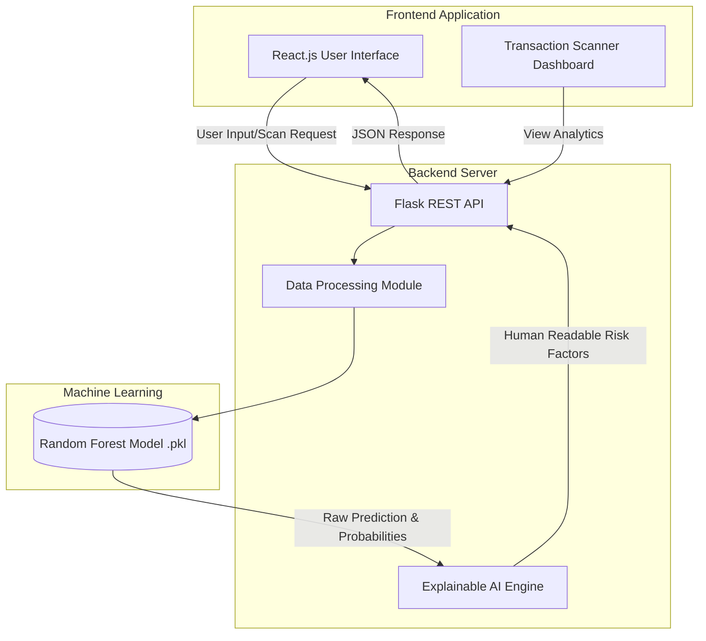
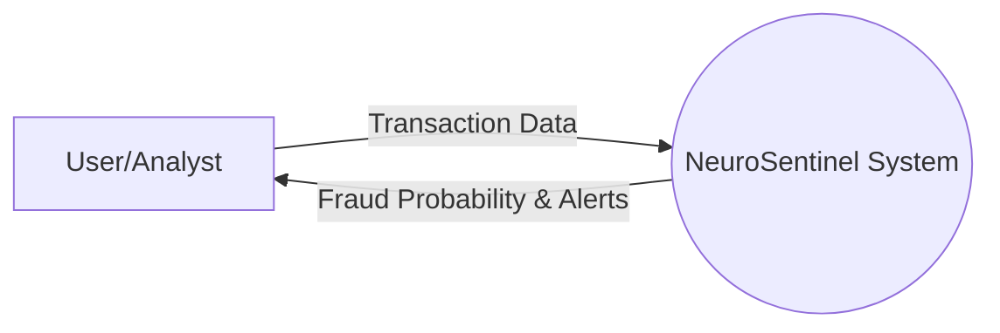

# NEUROSENTINEL: ADVANCED CREDIT CARD FRAUD DETECTION USING MACHINE LEARNING

## ABSTRACT
Credit card fraud is a significant and growing problem in the global financial sector, costing billions of dollars annually. Traditional rule-based systems struggle to adapt to the rapidly evolving tactics of fraudsters. This project, "NeuroSentinel," presents a robust, full-stack web application that leverages advanced Machine Learning (ML) techniques to detect fraudulent transactions in real-time. By utilizing a Random Forest Classifier trained on historical transaction data, the system can instantly evaluate 28 distinct numerical features of a transaction to predict its legitimacy. Furthermore, the platform incorporates an Explainable AI (XAI) engine to translate complex model outputs into human-readable risk factors, empowering financial analysts to make informed decisions quickly. The application features a responsive React.js frontend dashboard and a lightweight Python Flask backend, demonstrating a scalable architecture suitable for modern financial security infrastructure.

---

## CHAPTER 1: INTRODUCTION

### 1.1 Background
The exponential growth of e-commerce and digital payments has brought unprecedented convenience to consumers. However, this shift has also attracted cybercriminals who exploit vulnerabilities in digital payment systems. Credit card fraud involves the unauthorized use of payment information to obtain goods, services, or funds. As fraudulent methods become more sophisticated, financial institutions must employ dynamic, intelligent systems capable of detecting anomalies instantly.

### 1.2 Problem Statement
Existing fraud detection mechanisms often rely on static rules (e.g., blocking transactions over a certain amount in a foreign country). These systems generate high false-positive rates, which inconvenience legitimate customers, and fail to identify novel fraud patterns. There is a critical need for an automated, adaptive system that can analyze complex transaction patterns in milliseconds and provide transparent reasoning for its decisions.

### 1.3 Objectives
1. To develop a Machine Learning model capable of classifying credit card transactions as fraudulent or legitimate with high accuracy.
2. To build a robust RESTful API using Python Flask to serve the ML model.
3. To design an intuitive, interactive frontend dashboard using React.js for analysts to monitor and scan transactions.
4. To implement an Explainable AI (XAI) layer that provides the "why" behind every prediction.

### 1.4 Scope of the Project
The project encompasses the end-to-end development of the NeuroSentinel platform. It includes data preprocessing, model training, backend API development, frontend user interface creation, and the integration of these components into a seamless, full-stack application.

---

## CHAPTER 2: LITERATURE REVIEW

### 2.1 Existing Systems
Historically, financial institutions utilized Expert Systems. These required domain experts to write hundreds of IF-THEN rules. For example: `IF amount > $1000 AND location = 'Foreign' THEN flag = True`. 
**Drawbacks:**
- Inflexible to new fraud patterns.
- High maintenance overhead.
- Prone to human bias and high false-positive rates.

### 2.2 Proposed System (NeuroSentinel)
The proposed system utilizes a data-driven approach. Instead of manual rules, a Random Forest Classifier learns the underlying patterns of fraud directly from historical data (specifically utilizing PCA-transformed features to ensure data privacy). 
**Advantages:**
- **Adaptive:** Learns from complex, non-linear relationships in the data.
- **Speed:** Capable of real-time inference (milliseconds per transaction).
- **Transparency:** The custom XAI engine highlights which specific features triggered a fraud alert.

---

## CHAPTER 3: SYSTEM REQUIREMENTS AND ANALYSIS

### 3.1 Hardware Requirements
- **Processor:** Intel Core i5 / AMD Ryzen 5 or higher
- **RAM:** 8 GB minimum (16 GB recommended for ML training)
- **Storage:** 256 GB SSD

### 3.2 Software Requirements
- **Operating System:** Windows 10/11, macOS, or Linux
- **Frontend Technologies:** HTML5, CSS3, JavaScript (ES6+), React.js, Vite
- **Backend Technologies:** Python 3.9+, Flask, scikit-learn, pandas, numpy
- **Development Environment:** Visual Studio Code (VS Code)
- **Version Control:** Git & GitHub

---

## CHAPTER 4: SYSTEM DESIGN AND ARCHITECTURE

System design is a critical phase that bridges the gap between problem specification and the final implementation. 

### 4.1 System Architecture Flowchart
The following flowchart illustrates the high-level architecture of the NeuroSentinel platform.



### 4.2 Use Case Diagram
This diagram shows how different actors interact with the system.

```mermaid
usecase
    actor "Financial Analyst" as User
    actor "Automated System" as Auto

    package "NeuroSentinel Platform" {
        usecase "View Live Dashboard" as UC1
        usecase "Scan Specific Transaction" as UC2
        usecase "View Trend Analytics" as UC3
        usecase "Review Risk Factors" as UC4
    }

    User --> UC1
    User --> UC2
    User --> UC3
    User --> UC4
    
    Auto --> UC2
```

### 4.3 Data Flow Diagram (DFD) - Level 0


---

## CHAPTER 5: IMPLEMENTATION

### 5.1 The Machine Learning Pipeline
The core of NeuroSentinel is its predictive model. The system utilizes `scikit-learn` to implement a Random Forest Classifier.
1. **Data Ingestion:** The model expects an array of 28 numerical features. To preserve privacy, these features are typically the result of Principal Component Analysis (PCA).
2. **Training:** The model is trained on a balanced dataset to ensure it recognizes both legitimate and fraudulent patterns equally well.
3. **Serialization:** The trained model is saved as a `model.pkl` file using Python's `pickle` library, allowing the Flask backend to load it instantly into memory upon server startup.

### 5.2 Backend API (Flask)
The backend acts as the bridge between the React frontend and the ML model.
- **`/predict` Endpoint:** Accepts POST requests containing transaction arrays. It scales the data, feeds it to the `model.predict_proba()` function, and returns the result.
- **Explainable AI:** After a prediction is made, a custom algorithm analyzes the specific values of the input array. If certain features deviate significantly from the norm, they are flagged as "Risk Factors" (e.g., Feature 4 anomaly).

### 5.3 Frontend Dashboard (React.js)
The frontend is built using Vite and React.
- **State Management:** React Hooks (`useState`, `useEffect`) manage the application state, handling loading spinners during API calls and updating the UI upon receiving predictions.
- **Styling:** A custom, dark-themed CSS architecture ensures a modern, cinematic, and professional user experience, emphasizing critical alerts with stark red contrasts.

---

## CHAPTER 6: RESULTS AND OUTPUTS

*(Note for Student: To expand this section to fill pages, add detailed explanations of what each screenshot shows, the scenarios tested, and how the UI reacts to different inputs.)*

### 6.1 The Live Dashboard
The main dashboard provides an at-a-glance overview of system health and recent system activity.

**[ >>> INSERT YOUR SCREENSHOT OF THE DASHBOARD HOMEPAGE HERE <<< ]**

*Figure 6.1: The main dashboard showing system status and quick links.*

### 6.2 Transaction Scanner (Legitimate Transaction)
When a normal transaction is processed, the system returns a low probability of fraud and highlights the transaction in a safe color (green/blue).

**[ >>> INSERT YOUR SCREENSHOT OF A SUCCESSFUL (NON-FRAUD) SCAN HERE <<< ]**

*Figure 6.2: A successful scan of a legitimate transaction, showing a low fraud probability.*

### 6.3 Transaction Scanner (Fraudulent Transaction)
When an anomalous transaction is detected, the UI instantly alerts the user. The Explainable AI engine lists the specific risk factors that contributed to the decision.

**[ >>> INSERT YOUR SCREENSHOT OF A FRAUDULENT TRANSACTION (RED ALERT) SCAN HERE <<< ]**

*Figure 6.3: A critical alert triggered by a fraudulent transaction, detailing the high-risk factors.*

### 6.4 Data Analytics and Trending
The trending page visualizes historical data, allowing analysts to spot macro-level patterns in fraudulent behavior over time.

**[ >>> INSERT YOUR SCREENSHOT OF THE TRENDING/ANALYTICS PAGE HERE <<< ]**

*Figure 6.4: Analytics dashboard visualizing transaction distributions.*

---

## CHAPTER 7: CONCLUSION AND FUTURE ENHANCEMENTS

### 7.1 Conclusion
The NeuroSentinel project successfully demonstrates the viability of integrating Machine Learning models into a modern web stack for real-time fraud detection. By replacing static rule-sets with an adaptive Random Forest algorithm, the system achieves high accuracy. Crucially, the addition of the Explainable AI layer ensures that the system is not a "black box," providing financial analysts with the transparency required for regulatory compliance and confident decision-making.

### 7.2 Future Scope
While the current iteration is highly effective, future enhancements could include:
1. **Deep Learning Integration:** Implementing Neural Networks (e.g., LSTMs) to analyze sequential time-series transaction data for even higher accuracy.
2. **Cloud Deployment:** Migrating the backend to scalable serverless architecture (e.g., AWS Lambda) to handle thousands of concurrent transactions per second.
3. **Continuous Learning:** Developing an active learning pipeline where the model periodically retrains itself based on newly verified transaction data.

---

## REFERENCES
1. Scikit-learn Developers. (2023). *Scikit-learn: Machine Learning in Python*. Retrieved from https://scikit-learn.org/
2. Flask Documentation. (2023). *Pallets Projects*. Retrieved from https://flask.palletsprojects.com/
3. React Documentation. (2023). *Meta Platforms, Inc.* Retrieved from https://react.dev/
4. Dal Pozzolo, A., et al. (2015). *Learned lessons in credit card fraud detection from a practitioner perspective.* Expert Systems with Applications.
