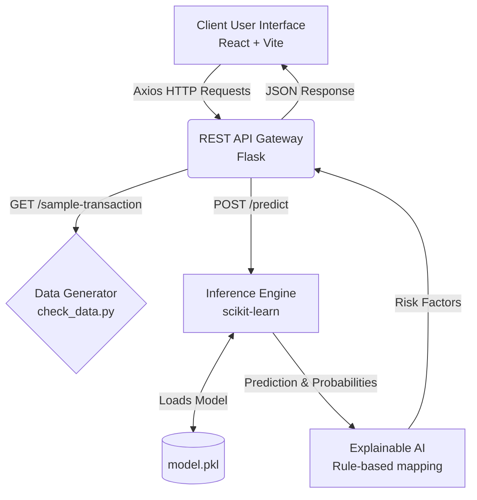

# Project Report: NeuroSentinel Fraud Platform

## 1. Project Overview
NeuroSentinel is a full-stack, machine learning-powered web application designed for real-time credit card fraud detection. It simulates the ingestion of transaction data and provides instantaneous probability scores and risk factor breakdowns to human analysts. The primary goal is to provide an intuitive, responsive, and data-rich interface to review potentially fraudulent transactions using an underlying Explainable AI (XAI) methodology.

## 2. Technology Stack

### Frontend (Client-Side)
- **Framework:** React.js powered by Vite for rapid development and lightweight builds.
- **Routing:** React Router DOM (v6.20+) for client-side navigation.
- **Styling & UI:** Vanilla CSS focusing on dark mode design, dynamic animations, and responsive layout. Icons provided by `lucide-react`.
- **Data Visualization:** Recharts for dynamic analytical charts (e.g., probability trends, distribution).
- **HTTP Client:** Axios for robust API requests to the backend.

### Backend (Server-Side)
- **Framework:** Python Flask (v3.0+) for creating lightweight, fast REST API endpoints.
- **Cross-Origin Configuration:** Flask-CORS to handle request sharing between the React frontend and Python backend.
- **Data Processing:** `numpy` and `pandas` for handling matrices, vectors, and feature structuring algorithms.
- **Machine Learning:** `scikit-learn` to process data inputs against the pre-trained classification model.

### AI / Machine Learning
- **Model:** Pre-trained machine learning model (`model.pkl`) stored locally.
- **Explainable AI (XAI) Engine:** Simulates model interpretability by translating feature magnitudes into human-readable risk factors (e.g., "Location Improbability", "Velocity Metric", "Time Anomaly") with qualitative impact levels ("Critical", "High", "Elevated").

## 3. System Architecture



## 4. Key Application Features

1. **Live Dashboard (`/`)**: 
   The main entry point containing high-level overviews and system status. Features a live datetime clock and quick-action widgets.

2. **Transaction Scanner (`/scanner`)**:
   An interface allowing the user (or automated systems) to scan a specific 28-feature array representing a credit card transaction. Displays an instant output covering:
   - Overall Fraud Probability.
   - Categorical Prediction (Legitimate vs. Fraudulent).
   - Top Risk Factors explaining the logic behind the classification.

3. **Analytics & Trending (`/analytics`, `/trending`)**:
   Pages dedicated to historical trends, statistical distributions, and platform intelligence, typically powered by data visualization libraries (Recharts).

4. **REST APIs**:
   - `GET /`: Platform health check verifying if the inference model loaded correctly.
   - `GET /sample-transaction?type=(legitimate/fraud)`: Endpoint to bootstrap the UX with randomized but structured transaction samples for testing.
   - `POST /predict`: The core inference endpoint. Expects a JSON payload array of 28 scaled numerical features, responding with probability logic and human-readable risk identifiers.

## 5. Security and Data Structure Notes
- The model exclusively requires 28 numerical features—meaning personal identifiable information (PII) like names or plain-text card numbers are decoupled before they reach the model pipeline, ensuring better data privacy.
- Advanced features analyzed include metrics scaled as Principal Component Analysis (PCA) features typical of the Kaggle Credit Card Fraud dataset properties.

## 6. Local Development and Execution

### Running the Backend
```bash
cd server
python -m venv .venv
# activate virtual environment (e.g., .venv\Scripts\activate on Windows)
pip install -r requirements.txt
python app.py
```
*(Runs on http://localhost:5000)*

### Running the Frontend
```bash
cd client
npm install
npm run dev
```
*(Runs on Vite dev server, typically http://localhost:5173)*
